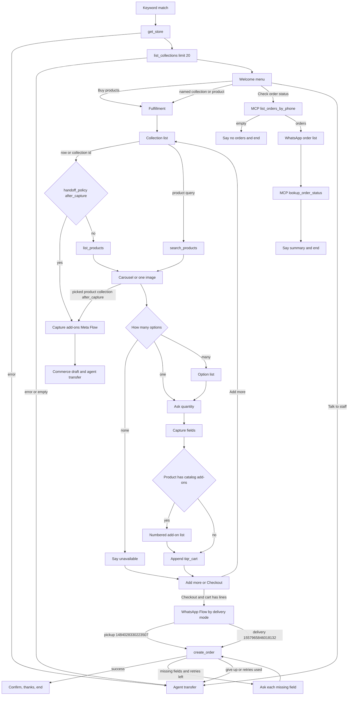

# TiQR Ecommerce coded flow

Code: `internal/handlers/tiqrecommerce/`. Key: `tiqr_ecommerce`. Engine: `internal/handlers/codedflow/`.

This is the code-level map of that function: the customer path, where AI actually runs, and the gaps. The admin-facing page is `docs/src/content/docs/features/coded-flows.mdx`. AI role settings are in `docs/coded-flow-ai.md`.

The function is a script. It does not let a model browse the catalog or place the order. A button, list row, or carousel card that this step offered is accepted in code. AI runs only for free text, for translating authored lines, and for classifying a failed `create_order`.

## How a turn runs

`runCodedFlow` in handlers (via `codedflow.Run`) starts the function from the top on every inbound message. Finished calls are replayed from `SessionData._coded_calls` in order. Call order is the identity of a step. Names can repeat inside the buy loop (`products`, `cart`, `quantity`) because the next unread record is what matters, not the name.

The keyword that started the flow is not an answer. `CurrentStep` is empty on that first turn, so the trigger text is cleared before `tiqrEcommerce` runs.

A call that returns false means stop this turn. The customer is waiting, a guide question was just sent, or the flow already transferred or ended. The session is persisted at the end of the turn.

## Customer path



Checkout said in free text on the menu, the collection list, a product card, an option list, the quantity prompt, or the add-more prompt jumps to the same checkout, after an empty-cart message if `tiqr_cart` has no lines. That divert is not applied during fulfillment or during an early handoff. See Gaps.

### 1. Load the store

`Store("store", "get_store")` then `StoreList("collections", "list_collections", limit 20)`. Either failure transfers with a fixed line (`tiqrEcommerceFailBusiness` or `tiqrEcommerceFailCollections`) and completes the session. An empty collection list is the same failure: `StoreList` treats zero rows as not ok.

`delivery_modes` on the store payload decides fulfillment later. Nothing else from the store is required to show the menu.

### 2. Welcome menu

Buttons, in order:

| Id | Title |
| --- | --- |
| `buy_products` | Buy products |
| `check_order_status` | Check order status |
| `talk_to_agent` | Talk to staff |

The body is `Welcome to {store name}.` plus `What would you like to do?` when the store has a name.

`askRouteButtons` is called with `AllowCatalog: true`. A tap on those three ids does not call AI. Free text can resolve to:

| Route | What the function does |
| --- | --- |
| `choice` / `buy_products` | `buyProducts` with an empty route, so the collection list is next |
| `choice` / `check_order_status` | `orderStatus` |
| `choice` / anything else, including `talk_to_agent` | `Transfer(codedAgentHandoff)` |
| `collection` | `buyProducts` with that collection id. The id must be one of the loaded collections |
| `product` | `buyProducts` with a search query. The model supplies words, not a product id |
| `checkout` | `afterCheckoutDivert`. Empty cart continues into browsing. A cart opens checkout |
| `handoff`, ungrounded JSON, or an AI error | transfer |

### 3. Fulfillment

`resolveFulfillment` runs once at the start of `buyProducts`, before the collection list. It reads `delivery_modes` already stored on the session.

| Store modes | Behaviour |
| --- | --- |
| Missing or empty | No prompt. `delivery_mode` is set to `PICKUP_FROM_STORE` inside `Once`, then browsing continues |
| Only `PICKUP_FROM_STORE` | One button, Proceed. Then pickup |
| Both | Store pickup or Delivery |
| Only `DELIVERY_TO_LOCATION` | No mode buttons. Goes straight to a location pin. `delivery_mode` is set inside `Once` |

Delivery asks for a WhatsApp location pin (`AskLocation`). Distance is computed in `evaluateStoreDelivery` (`internal/handlers/tiqrecommerce/delivery.go`) from the store latitude, longitude, `free_delivery_radius`, and `delivery_radius`. There is no MCP call.

| Zone | Next step |
| --- | --- |
| `free` | Say free delivery, store the zone and distance, continue |
| `paid` | Say a fee may apply. `ShippingFeePaise` from this function is always 0, so the rupee amount is not filled in |
| `unconfigured` | Treated as deliverable. The customer is told delivery is possible |
| `out_of_range` and pickup exists | Offer Store pickup or Share again |
| `out_of_range` and delivery only | Say the out-of-range line and ask for another pin. The loop has no attempt cap |

A deliverable pin stores `delivery_mode`, `delivery_zone`, `delivery_distance_km`, and `shipping_fee_paise` when the fee is greater than 0. The pin itself is stored by `AskLocation` as `delivery_latitude` and `delivery_longitude`.

### 4. Collections and products

The collection list uses header `Our collections`, button `Browse`, row title `{{name}}`, description `{{description}}`. A chosen row saves `collection_id` from `id` and `collection_name` from the rendered title.

`askRouteList` also has `AllowCatalog: true`, so free text on this step can name another loaded collection or a product.

#### Early-handoff collections (`handoff_policy: after_capture`)

When the chosen collection has `handoff_policy: after_capture` (or a named product belongs to such a collection), the flow does not show product cards, does not ask quantity, and does not write `tiqr_cart` or call `create_order`. Catalog value stays `after_capture`; session keys and coded-call names use `early_handoff_*`.

Code: `runEarlyHandoff` in `internal/handlers/tiqrecommerce/early_handoff.go`.

1. Intro: `This is a custom {name} request — I’ll collect a few details and connect you with our team.`
2. Required capture fields from that collection (same prompts as the cart path). Checkout phrases do not divert away from these questions.
3. Add-ons: shared numbered catalog add-on step when the product has catalog add-ons. Products with no catalog add-ons skip this step.
4. Customer details via the same WhatsApp Flow as checkout (`AskFlow`): pickup flow `1484028330223507` (name, email, phone) or delivery flow `1557965846018132` (name, phone, address). Flow fields are copied onto the commerce draft address snapshot and notes.
5. Commerce draft + `completeCommerceCapture` creates an agent transfer with source commerce, sends `handoff_message` (or the default specialist line), and cancels the bot session. Before the draft sync, capture answers are formatted with `CodedOrderNotes` into `commerce_notes.order_notes` (same string as checkout orders), including product/option headers from the staged early-handoff cart line. The cart and order paths are skipped.

Fulfillment time (`list_fulfillment_slots` / `propose_fulfillment_time`) is skipped for now. Pickup vs delivery and the location pin already ran earlier in the buy flow.

Image and file capture fields are asked as text; the coded runner does not attach WhatsApp media the way the commerce chatbot does.

`productsForRoute`:

| Route | Store call |
| --- | --- |
| `collection` or `choice` with an id | `list_products` with `category_id`. The first call does not pass limit or offset. A later Show more follows `next`, or repeats the call with `offset` |
| `product` with a query | `search_products` with `search` and `limit` 20. `collection_name` is overwritten with the query |
| empty query or empty id | "I couldn't find that" and the buy loop shows collections again |
| API error (`lastTiqrErr` set) | transfer with `tiqrEcommerceFailProducts` |
| any other kind | transfer |

WhatsApp list messages and carousels hold at most 10 rows (`chatbot_graph_runner.go`). When `count` is greater than 10, or more than 10 rows are already loaded, the message shows 9 rows and a **Show more** row. Show more repeats until the last page, which lists the remaining rows and omits Show more. A page of 10 or fewer is sent whole. Collections, the product carousel, the option list, and the order list all use this.

If the API page is shorter than `count` (limit 50, 50 rows loaded, count 100), Show more calls that response's `next` URL before rendering the next WhatsApp page. When `next` is absent, the same list operation is called again with `offset` set to how many rows are already loaded. Rows already stored are not added twice. This covers `list_collections`, `search_collections`, `list_products`, `search_products`, `list_product_options`, `list_faqs`, and `list_orders_by_phone`.

Free text on the collection list can name a collection that has been loaded, including rows fetched by a later Show more, even when that row is not on the current page. The product step still does not take a catalog route (see AI).

One product is an image reply with Add to cart, because a carousel needs two cards. Two or more products are a carousel. A missing image uses the hardcoded fallback URL `tiqrEcommerceFallbackMedia`.

### 5. Option, quantity, cart

| Options on the selected product | What happens |
| --- | --- |
| 0 | `tiqrEcommerceUnavailable`. Nothing is added. The flow still asks add-more or checkout |
| 1 | That option is taken. No list |
| 2 or more | Option list. Title is `{{name}} (₹{{price}})` |

Quantity uses `AskNumber` with pattern `^[1-9][0-9]*$`. Digits of 1 or more are accepted in code. A number word is accepted only when intent returns route `answer` with a value that matches the pattern.

### Catalog add-ons

After capture fields and before the cart line is written, the flow loads the product with `get_product` and reads active catalog add-ons from the product and from the chosen option. The same numbered step runs in early handoff (`early_handoff_addons_1`). When that handoff already knows the product, only that product is loaded. When the collection has several products and none was selected, each listed product is loaded and the numbered list is shown if any of them have active catalog add-ons.

When the product has catalog add-ons, the customer sees a numbered list with prices when present:

```
This product has the following add-ons:
1. Candles — ₹50
2. Flowers — ₹100

Reply with the item number and how many you want, for example item 1 - 2.
You can list more than one item. Say Skip if you don't want any.
```

Exact `skip`, `no`, `none`, or `done` continues with nothing stored. Every other reply is parsed by the guide AI role into JSON (`intent`, `confidence`, `items` with list indexes and quantities, `missing_quantity`, `question`). The model is told to use list indexes only and never invent addon ids.

Go then grounds that JSON against the loaded choices:

| Outcome | Next step |
| --- | --- |
| Grounded `select` at confidence ≥ 0.75 | Save `{addon, quantity, name}` onto `commerce_addons`, confirm, continue |
| Missing quantity for a named item | Ask specifically for that item's quantity (up to 3 clarify turns) |
| Unclear, low confidence, or out-of-range index | Ask a short clarifying question (up to 3 turns) |
| Still unclear after 3 clarify turns | Transfer to an agent |

Products with no catalog add-ons skip this step on the buy path and on early handoff. Early handoff uses the same numbered catalog add-on step when loaded products have active catalog add-ons.

### Collection capture fields

After a valid quantity, and before the cart line is written, the flow reads `required_capture_fields` for the collection this product belongs to. The product's `category_id` (or embedded `category`) wins when it matches a loaded collection. Otherwise the selected `collection_id` is used.

Each field with `required: true` and a non-empty `key`, `label`, and `type` is its own question. Optional and incomplete fields are skipped. The prompt is the same text the commerce chatbot uses: label, then help text, then `Options:` when the field has options. A `number` must parse as a number. `single_select` and `multi_select` must match the options (`multi_select` is comma-separated). Any other non-empty reply is accepted. A value that fails that check is not stored; the customer is asked again with `Please provide a valid value.` A checkout phrase that is not a valid answer for that field leaves the question and follows the normal checkout divert.

Answers are stored on the session as `commerce_captured_fields` (latest value per key) and `commerce_capture_labels`. The cart line also stores `product_name`, `option_name`, `capture_fields`, `capture_labels`, and `capture_order` (keys in the order asked) for the answers given on that add. The same option added again with the same answers increases quantity. A different answer for the same option is a separate line, so two cakes can carry two messages. The cart summary and the failed-order handoff list each answer under its label.

`create_order` still sends items as `product_option` and `quantity` only. The answers go in `notes`. With no capture answers, `notes` stays the plain `customer_notes` string. With answers, `notes` is plain text per cart line:

```
{product_name}({option_name})
- {field label}: {answer}
```

A blank line separates products. When the customer also typed a form note, a final `Note: {customer note}` line is appended.

Then buttons `add_more`, `edit_cart`, and `checkout`. Add more returns to the collection list. Checkout reviews the cart, then breaks the loop.

### 6. Checkout

`AskFlow` opens a WhatsApp Flow by delivery mode, button Enter details. Both flow ids are constants and must exist on the WhatsApp account under those Meta ids.

| `delivery_mode` | Meta flow id | Form fields | Body |
| --- | --- | --- | --- |
| `PICKUP_FROM_STORE` (or empty) | `1484028330223507` | `customer_name`, `customer_email`, `customer_phone`, `customer_notes` | Name, email, and phone. No address |
| `DELIVERY_TO_LOCATION` | `1557965846018132` | Same contact fields plus address lines | Name, phone, and address |

`pickupOrderParams` builds `create_order`:

| Param | Source |
| --- | --- |
| `email` | `customer_email` or `email` if it matches a simple email. Phone fields are skipped. Other session values are scanned for an email |
| `phone_number` | `customer_phone`, `phone`, or `phone_number` when present |
| `items` | `tiqr_cart` lines reduced to `product_option` and `quantity`. The TiQR client turns those strings into integers |
| `addons` | `commerce_addons` reduced to `addon` and `quantity` when any were selected. Display names are not sent |
| `notes` | `customer_notes` or `notes` when the cart has no collection answers. Otherwise plain text: `{product_name}({option_name})` then `- {label}: {value}` per capture field, with a blank line between products and `Note: {customer note}` when a form note exists |
| `new_address` | Delivery only: name, address lines, city, state, country, pincode, email, phone, plus latitude and longitude to 6 decimal places. Omitted for pickup |
| `delivery_mode` | session value, or `PICKUP_FROM_STORE` if empty |
| `buyer_meta_data` | `name`, `email`, `phone`, `phone_number`, and `notes` when set (same notes string as the order). Delivery also includes latitude and longitude |

`shipping_fee_paise` is not sent.

Success sends an order-placed message (display uid, delivery fee, total when present). When the create_order response includes a payment URL (`payment.meta_data.url_to_redirect`, or a top-level `payment_url` in preview mocks), that message is a WhatsApp CTA URL button labeled **Pay now**. The flow then `End`s. It does not tell the customer the order is already confirmed.

Failure calls `createRecoverPlan`. If the plan is `missing_field` and retries remain, `collectRecoverFields` asks for every missing field in a fixed order, stores each reply on the session, and `create_order` runs again. Otherwise the customer is transferred with `formatFailedOrderHandoff`, which lists cart lines and the address. The recover model's own sentence is not sent on that path.

Retries come from `[codedflow] order_retries`, default 2. The loop is `attempt := 0; attempt <= retries`, so the default is one try plus two retries. Missing fields are collected only while `attempt < retries`.

### Agent handoff snapshot

Every `Transfer` from this flow (talk to staff, failed order, ungrounded intent, store or product load failure) snapshots the session onto a `CommerceDraft` and creates an agent transfer with `source: commerce` and `metadata.kind: commerce_handoff`, the same shape as early handoffs.

| Draft / metadata field | Source |
| --- | --- |
| `cart` | `{ "source": "tiqr_ecommerce", "lines": [...] }` from `tiqr_cart` (option id, quantity, names, capture fields). Empty cart still transfers with `lines: []` |
| `addons` | `commerce_addons` as `{addon, quantity, name}` when selected. Shown on the owner handoff API and chat panel; Create order prefills quantities |
| `address` / `AddressSnapshot` | WhatsApp Flow contact and address fields, plus delivery pin |
| `fulfillment` | `delivery_mode`, latitude, longitude |
| `captured_fields` | `commerce_captured_fields` |
| `notes` | `codedOrderNotes` / customer notes |
| `missing_fields` | Last `create_order` recover plan asks, when present |

Outside business hours the out-of-hours message is sent and no draft transfer is created. If the draft cannot be saved, Transfer falls back to the generic queue transfer so the customer still reaches a person. Staff Create Order in tiqr.store prefills from this handoff; the order is not placed automatically.

### 7. Order status

`orderStatus` lists recent orders for this WhatsApp number over MCP:

`list_orders_by_phone` with `store_id`, the session phone, and `limit` (max 10)

No store-owner token is required; the tool authorizes by matching `ordered_by` / `ordered_for` phone. Commerce MCP (`ai_commerce_mcp_url` + store id) must be enabled. A tool error says order status is unavailable and ends. An empty list says `tiqrEcommerceOrderMissing` and ends.

When orders exist, WhatsApp shows a list (title = `display_uid`, description = placed date). Selecting a row loads full detail over MCP:

`lookup_order_status` with `store_id`, the session phone, and `order_display_id` = the selected `display_uid`

The reply includes status, line items with prices (minor units converted once), total, fulfillment mode, and address when delivery. No payment link is attached. Payment retry stays on the separate commerce path.

## Where AI runs

Four roles, configured per chatbot AI settings. Default provider is Account AI. Intent may use TypeSafe Jev or AI Gateway System One. Translation, guide, and recover cannot use Jev, because Jev does not generate free text. Thresholds live in `codedIntentSettings`: confidence `0.75`, guide turns `3`, order retries `2`.

This file never calls a model itself. The calls are inside `Conv`.

### Intent

`resolveFreeText` in `internal/handlers/codedflow/intent.go`. It runs when the reply is not an offered button id or title.

Steps in this flow that can reach it:

| Step | Call | Catalog routes allowed |
| --- | --- | --- |
| Welcome menu | `askRouteButtons` | yes: collection id and product query |
| Collection list | `askRouteList` | yes |
| Fulfillment buttons | `AskButtons` → `askChoice` | no |
| Product card or carousel | `AskImageButtons` / `AskCarousel` | no |
| Option list | `AskList` | no |
| Add more / checkout | `AskButtons` | no |
| Quantity, if the text is not digits | `AskNumber` | no, but route `answer` is allowed |
| Location pin, if the message is not a pin | `AskLocation` | no |
| Details form, if the message is not the flow submission | `AskFlow` | no |

The model must return one route and leave the other slots empty. Go then checks the allow-list (`validateCodedIntent`):

- `choice` id must be a button on this step
- `collection` id must be in the loaded collections, and only when catalog is allowed
- `product` is a non-empty query, only when catalog is allowed. No product id is trusted
- `answer` must match the step pattern
- `checkout` and `handoff` must not carry ids
- anything else, including a product route on a step that does not allow catalog, is ungrounded

At or above 0.75 and grounded: the route is applied in the same turn. `checkout` sets `c.divert` and does not record a shopping call, so the script can leave the step. Below 0.75, or route `unclear`: one guide question, staying on the same step.

Ungrounded output, a grounded `handoff`, or an intent error transfers immediately with `codedAgentHandoff`. The customer does not get a guide question in those cases.

Language from the first successful intent call is stored as `customer_language` only if the session does not already have one. Button taps never set it.

### Guide

`askGuide`. One short question, in the stored language (default `en`). Up to 3 questions per step, counted in `SessionData._coded_guide`. The 4th unclear reply transfers. An empty question or a guide error also transfers. A later confident route clears the counter.

Catalog add-on selection also uses the guide role to parse free text into indexed quantities. Clarify turns for missing quantity or unclear replies share the same 3-turn cap on that add-on step before transfer.

### Translation

`Conv.text` in `internal/handlers/codedflow/ai.go` runs on every authored line before send, including button titles (then truncated to 20 characters). It does not run when `customer_language` is empty, `en`, or `en-*`. English taps therefore stay in the authored English.

Catalog text is not translated: collection names, product names, option names, and prices stay as the store sent them. Placeholders, asterisks, numbers, prices, and line breaks are supposed to be kept. Results are cached on the session under `_translations`. A translation error sends the English source.

### Order recovery

`createRecoverPlan` → `runRecover` after `create_order` returns not ok. The model sees a sanitized hint, not the raw HTTP body. URLs, tokens, and curl text are stripped.

| Kind | What checkout does |
| --- | --- |
| `missing_field` | Ask the listed session fields, one `AskText` each, then retry |
| `try_later` or `give_up` | Ignore the model's sentence. Transfer with the cart handoff text |
| AI error or invalid JSON | Same transfer, using the canned failed-order fallback inside the plan only as a stored message |

If the TiQR error hint contains `validation fields: ...`, `expandRecoverAsks` replaces the model's field list with those names and forces `missing_field`. The model does not get to drop a field the API named. Field order is fixed: name, phone, email, address line 1, address line 2, city, state, country, pincode, notes.

`AskText` for those fields does not call intent. The `StepNote` is ignored (`_ = step`).

Fetch failures in this flow do not call `recoverFetchMessage`. Store, collection, and product errors transfer with a fixed sentence.

## What is not AI

- Loading the store, collections, products, and search results
- Distance and delivery zone
- Appending the cart
- Building the `create_order` body
- Order-status lookup and the status sentence
- Exact taps on an offered id or title
- The decision to transfer after an ungrounded route

Collection `AIInstructions` are not read aloud. Required capture fields on the loaded collection are asked one at a time when an option is added. See Collection capture fields.

## Session values this flow writes

| Key | When |
| --- | --- |
| `store` | `get_store` |
| `collections` | `list_collections` rows |
| `delivery_mode` | Fulfillment. `PICKUP_FROM_STORE` or `DELIVERY_TO_LOCATION` |
| `delivery_latitude`, `delivery_longitude` | Accepted pin |
| `delivery_zone`, `delivery_distance_km`, `shipping_fee_paise` | Deliverable pin. Fee stays unset while the calculator returns 0 |
| `collection_id`, `collection_name` | Collection choice, or the search query for a product route |
| `products`, `product_id`, `product_name`, `options`, `product_selected` | Product choice |
| `option_id`, `option_name`, `quantity` | Option and quantity |
| `commerce_captured_fields`, `commerce_capture_labels` | Each required collection field answered while adding an option |
| `commerce_addons` | Catalog add-ons chosen for this session (`addon`, `quantity`, `name`) |
| `tiqr_cart`, `cart_count` | Each append. A line may also include `product_name`, `option_name`, `capture_fields`, `capture_labels`, and `capture_order` |
| `customer_language` | First free-text intent, if unset |
| form fields | WhatsApp Flow submission, plus any field recover asks for |
| `order` | Successful `create_order` |

`phone_number` and `contact_name` are written by `runCodedFlow` on every turn, before this function runs.

## Gaps

1. **Checkout during fulfillment is dropped.** `resolveFulfillment` and `resolveDeliveryLocation` return false when the reply is not the expected button or pin. `buyProducts` then returns without `applyCheckoutDivert`. Intent can still set `c.divert` to checkout, but this turn sends nothing and does not open the form. The same step is waiting on the next message. Checkout from the menu, collection list, product, option, quantity, and add-more steps does call `applyCheckoutDivert`.

2. **Naming a product on a product card transfers.** Product, option, fulfillment, quantity, location, and the details form call `resolveFreeText` with catalog routes off. A grounded `product` or `collection` route is rejected and the customer is transferred. Only the menu and the collection list can search or jump to a collection.

3. **Delivery fee is never priced or charged.** `evaluateStoreDelivery` documents that the flat store shipping fee is not on the `get_store` payload, so `ShippingFeePaise` stays 0. The paid-zone sentence falls through to "an additional delivery fee may apply." `pickupOrderParams` does not send `shipping_fee_paise` even if it were set.

4. **Delivery-only and out of range does not end.** `resolveDeliveryLocation` asks for another pin forever when pickup is not allowed. There is no attempt limit and no automatic transfer. A typed handoff can still transfer, because a non-pin message goes through intent.

5. **Recovery replies are literal.** While collecting a missing email or address, "talk to staff" is stored as that field. Intent is not run. A bad value is sent again on the next `create_order`.

6. **Non-field order failures hide the recover sentence.** `try_later` and `give_up` do not `Say` the model message or `tiqrEcommerceFailed`. The customer gets the cart-and-address handoff and a transfer. Thanks is sent only after a successful create.

7. **No cart management.** Lines are append-only. There is no view, edit, remove, or merge of the same option. `cart_count` is the line count, and the added-to-cart sentence reads as if it were a unit count. Quantity `0` matches `^[0-9]+$`. Stock is not checked before add.

8. **Search labels the carousel with the query.** `productsForRoute` sets `collection_name` to the search string, and the carousel body says the items are available in that name.

9. **Empty store data is a transfer, not a retry inside the session.** `get_store` or `list_collections` failure completes the session. A later keyword can start a new session and call TiQR again. Within one session those calls are not retried, because the flow has already ended.

10. **Hardcoded Meta flow ids and fallback image.** Pickup uses `tiqrEcommercePickupFlowID` (`1484028330223507`). Delivery uses `tiqrEcommerceFlowID` (`1557965846018132`). Both checkout and early handoff use these. The fallback product photo is one DigitalOcean Spaces URL. A store whose form id differs, or a dead image URL, fails open at checkout or shows the wrong photo.

11. **Language is sticky.** The first non-empty intent language wins for the session. A later message in another language does not replace it, so translation keeps using the first label.

12. **Order status is thinner than commerce checkout.** No payment link, no retry payment, no order id prompt. A failed lookup and a customer with no orders share one sentence.

13. **Collection AI instructions are not read aloud.** Required capture fields are asked as their own questions before the cart line. The store-authored `ai_instructions` text is still not added to the prompt. File fields accept a text reply, because this flow does not collect a WhatsApp attachment.
